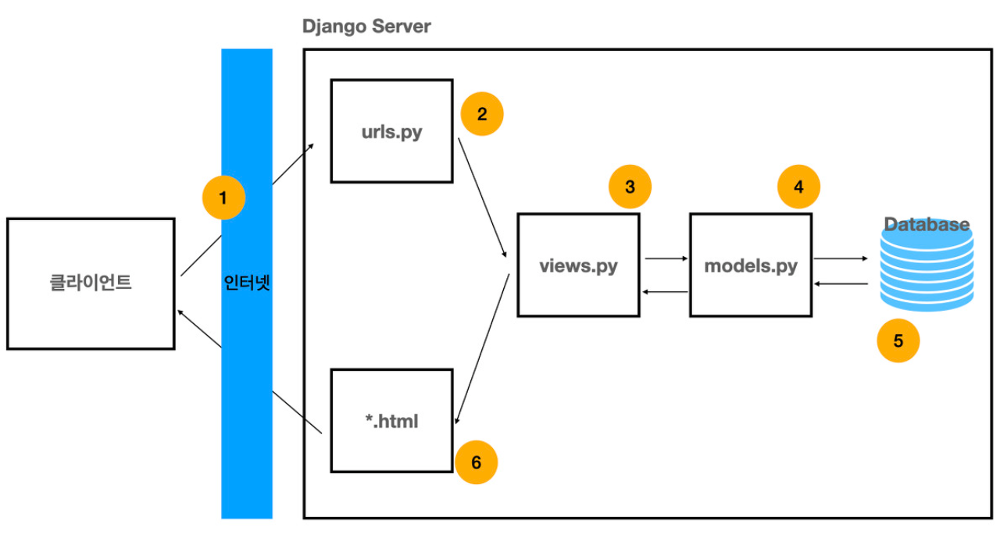
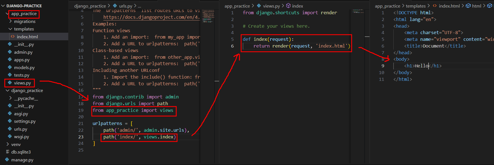

# Django

## django란?

- python을 기반으로 한 오픈소스 웹 어플리케이션 프레임워크이다.
- 프레임워크(framework)란, 웹 서비스를 만드는 과정에서 편의성을 제공하기 위해 만들어진 작업장이라고 한다. 즉, 어떤 어플리케이션을 개발하기 위해 필요한 기본적인 클래스와
라이브러리등이 모두 포함되어있는 환경을 의미한다.
- Frame(틀 속에서) Work(작업한다) 라고 생각하면 편하다.

<br>

## django의 특징은?

- **MTV 패턴**
    - 기본 구성은 **모델(Model)**, **템플릿(Template)**, **뷰(View)** 로 **MTV 패턴**을 따릅니다.
    - **Model** : DB 데이터 저장소, models.py에 데이터에 대한 정보를 정의한다. MVC모델에서의 Model과 같다.
    - **Template** : 사용자 인터페이스를 제공하며, HTML,CSS와 같다. MVC모델에서의 View와 같다. 
    - **View** : 사용자의 요청을 받아 모델로부터 가져온 데이터를 가공하여 템플릿에게 전달한다. MVC모델에서의 Controller와 같다. 



<br>

## django 가상환경 이해 및 셋팅

### 가상환경이란?
- 독립적인 파이썬 실행 환경을 의미한다.
- 각각의 가상환경은 다른 환경에 영향을 미치지 않으며 각자 다른 종류와 버전의 패키지를 가질 수 있다.

 <br> [출처](https://hypebeast.kr/2021/1/ready-player-one-two-movie-sequel-ernest-cline-production-info)
> 가상환경이라고 하니 생각나는 건 이 영화...

<br>

### 가상환경이 필요한 이유

- 가상환경으로 각자 독립된 개발 환경을 제공해주기 때문에 각 개발 프로젝트에서 사용되는 패키지들의 버전을 기록하고 알맞은 환경을 세팅한 다음 개발이 가능하다.

<br>

### django 가상환경 셋팅

<br>

1. 프로젝트 생성
```
django-admin startproject <pjtname>.
```

2. 가상환경 설정
```
python -m venv venv
```

3. 가상환경 활성화/비활성화
```
<!-- window -->
source venv/Scripts/activate
<!-- macOS -->
source venu/bin/activate

deactivate
```

4. 가상환경 내부에 django 설치
```
pip install django
```

5. 서버 실행 확인(종료 `ctrl + c`)
```
python manage.py runserver
```


6. 앱생성
```
django-admin startapp <appname>
```

7. 앱등록
- `settings.py`의 `INSTALLED_APPS`에 등록
    `<appname>`을 등록

8. `urls.py`
```python
from django.urls import path
from app_intro import views

urlpatterns = [
    ...
    path('index/', views.index),
]
```


9. `view.py`
```python
def index(request):
    return render(request, 'index.html')
```

10. template 폴더 생성 => index.html 생성


