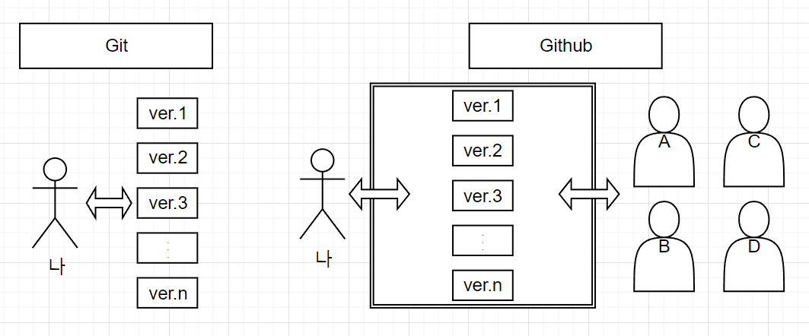

# 깃허브 특강

## 내가 생각하는 Git과 Github는?

> 내가 생각했던 깃과 깃허브는 이렇다..

- Git이란?
- Github란?

## Git으로 협업하기

1. organization 생성 및 조원 초대 후 repository 생성
2. git clone <주소> (폴더이름 겹칠 경우 지정가능)
3. 자신의 branch 생성 및 switch 하기
    - `git branch -c <자신의 branch명>`
    - `git switch <자신의 branch명>`
4. 자신의 branch에서 작업하기
5. 작업 후 아래 순서에 따라 git에 push하기
    - `git add .`
    - `git commit -m ""`
    - `git push origin <자신의 branch명>`
6. 자신의 branch에서 협업소 branch로 merge
7. master branch에서 pull해서 최신 데이터 가져오기
    -  `git switch master(또는 main)`
    - `git pull origin master(또는 main)`
    - `git switch <자신의 branch명>` 후 `git merge master(또는 main)`
8. 다시 자신의 branch에서 작업 후 push.