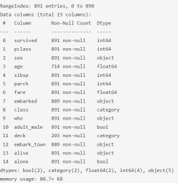
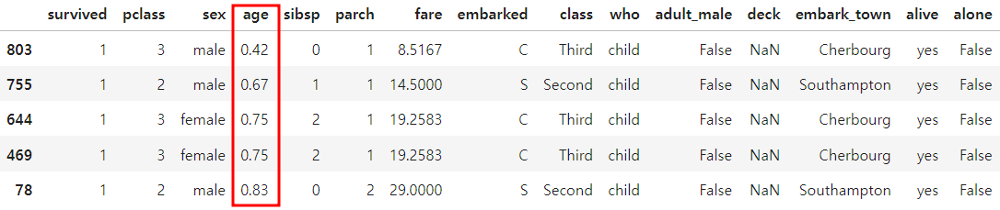
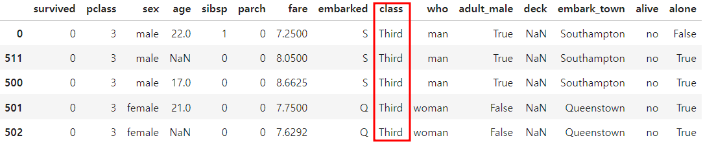
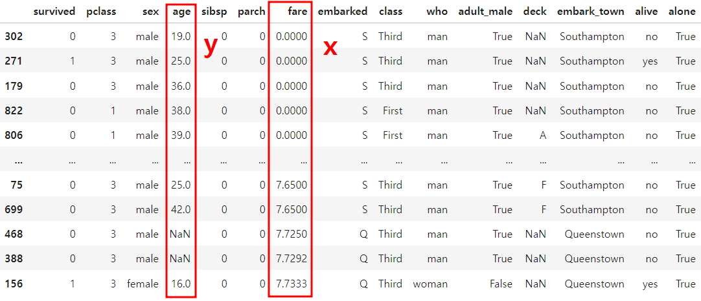
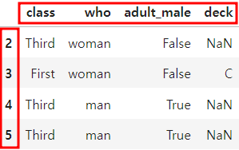
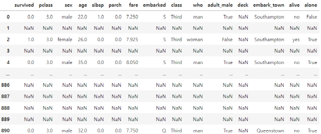

# 조회, 정렬, 조건필터(with 타이타닉호 데이터실습)

데이터를 정리, 분석할 때 이러한 기능 없이 제대로 분석하기란 불가능에 가깝습니다.

Pandas는 조회, 정렬, 조건필터의 기능을 매우 편리하게 사용할 수 있도록 지원합니다. 해당 기능을 사용하다보면 매우 직관적이고 사용성도 어렵지 않음을 알 수 있습니다.

특히, loc와 iloc는 자주 사용하는 기능으로, 이번 학습을 통해 충분히 숙지필요하다.

## 모듈 import
```python
from IPython.display import Image
import numpy as np
import pandas as pd
import seaborn as sns
```

## 타이타닉호 승객 데이터 분석을 통한 판다스 학습!
**주요 목표**

- Pandas를 활용하여 타이타닉호 생존자, 사망자 데이터를 분석합니다.
- 데이터를 토대로 생존율이 높은 승객, 생존율이 낮은 승객은 누구인지 판단합니다.

### head() 앞 부분 / tail() 뒷 부분 조회
- default 옵션 값으로 5개의 행이 조회됩니다.

- 괄호 안에 숫자를 넣어 명시적으로 조회하고 싶은 행의 갯수를 지정할 수 있습니다.

```python
df.head()
df.tail()
```

### info()
```python
df.info()
```

- 컬럼별 정보(information)를 보여줍니다.
- 데이터의 갯수, 그리고 데이터 타입(dtype)을 확인할 때 사용합니다.

<br/>



> **category** 타입도 있습니다. **object 타입**은 문자열, **category 타입**도 문자열이지만, '남자' / '여자'처럼 카테고리화 할 수 있는 컬럼을 의미 합니다.

<br/>


### describe()
```python
df.describe()

# include='object'를 통해 categorical column에 대한 요약 통계 확인 가능
df.describe(include='object')

# 'include'로 따로 구분하는 이유는 데이터는 숫자로 표현했지만 문자열로 되어있는 데이터를 평균을 내지 못하지 문자형 데이터는 따로 구분.
```
- 각 컬럼에 대한 요약 통계 제공
- 수치형 컬럼 (numerical column)의 통계를 기본으로 보여 줍니다.

<br/>

### value_counts()
- column 별 값의 분포를 확인할 때 사용합니다.
- 남자, 여자, 아이의 데이터 분포를 확인하고 싶다면 다음과 같이 실행합니다.

```python
df['who'].value_counts()

who
man      537
woman    271
child     83
Name: count, dtype: int64
```


<br/>

## 속성: Attributes
속성 값은 **함수형으로 조회하지 않습니다.**

자주 활용하는 DataFrame은 **속성 값**들은 다음과 같습니다.

- ndim : **차원**을 나타냄
- shape : **(행, 열)** 순서로 출력
- index : index는 기본 설정된 **RangeIndex가 출력**.
- columns : columns는 **열을 출력**
- values : values는 모든 값을 출력하며, **numpy array 형식으로 출력**.
- T : T: 전치 (Transpose) 는 Index와 Column의 축을 교환

```python
df.ndim
2

df.shape
(891, 15)

df.index
RangeIndex(start=0, stop=891, step=1)

df.values
array([[0, 3, 'male', ..., 'Southampton', 'no', False],
       [1, 1, 'female', ..., 'Cherbourg', 'yes', False],
       [1, 3, 'female', ..., 'Southampton', 'yes', True],
       ...,
       [0, 3, 'female', ..., 'Southampton', 'no', False],
       [1, 1, 'male', ..., 'Cherbourg', 'yes', True],
       [0, 3, 'male', ..., 'Queenstown', 'no', True]], dtype=object)

df.T
# 인덱스와 컬럼의 축을 교환하여 출력
```

## 타입 변환 (astype)
```python
df.info()

RangeIndex: 891 entries, 0 to 890
Data columns (total 15 columns):
 #   Column       Non-Null Count  Dtype   
---  ------       --------------  -----   
 0   survived     891 non-null    int64   
 1   pclass       891 non-null    int64   
 2   sex          891 non-null    object  
 3   age          714 non-null    float64 
 4   sibsp        891 non-null    int64   
 5   parch        891 non-null    int64   
 6   fare         891 non-null    float64 
 7   embarked     889 non-null    object  
 8   class        891 non-null    category
 9   who          891 non-null    object  
 10  adult_male   891 non-null    bool    
 11  deck         203 non-null    category
 12  embark_town  889 non-null    object  
 13  alive        891 non-null    object  
 14  alone        891 non-null    bool    
dtypes: bool(2), category(2), float64(2), int64(4), object(5)
memory usage: 80.7+ KB

# int32로 변경
df['pclass'].astype('int32').head()

0    3
1    1
2    3
3    1
4    3
Name: pclass, dtype: int32

# object로 변경
df['pclass'].astype('str').head()

0    3
1    1
2    3
3    1
4    3
Name: pclass, dtype: object

# category로 변경.
# category로 변경시에는 Categories가 같이 출력 됩니다.
df['pclass'].astype('category').head()

0    3
1    1
2    3
3    1
4    3
Name: pclass, dtype: category
Categories (3, int64): [1, 2, 3]
```

## 정렬 (sort)

### sort_index: index 정렬
- index 기준으로 정렬합니다. (기본 오름차순이 적용되어 있습니다.)
- 내림차순 정렬을 적용하려면, ascending=False를 옵션 값으로 설정합니다.

```python
df.sort_index().head(5)

df.sort_index(ascending=False).head(5)
```
</br>

### sort_values: 값에 대한 정렬
- 값을 기준으로 행을 정렬합니다.
- by에 기준이 되는 행을 설정합니다.
- by에 2개 이상의 컬럼을 지정하여 정렬할 수 있습니다.
- 오름차순/내림차순을 컬럼 별로 지정할 수 있습니다.

```python
df.sort_values(by='age').head()
# 값을 기준으로 행을 정렬할 때 인덱스번호가 같이 바뀌진 않음

# 내림차순 정렬: ascending=False
df.sort_values(by='age', ascending=False).head()
```


</br>

> **문자열 컬럼도 오름차순/내림차순 정렬**이 가능하며 알파벳 순서로 정렬됩니다.
```python
df.sort_values(by='class', ascending=False).head()
```


</br>

> **2개 이상의 컬럼을 기준으로 값 정렬** 할 수 있습니다.
```python
df.sort_values(by=['fare', 'age']).head(100)
# 우선순위는 x, y 중에 x가 우선으로 출력되고 y는 그 다음으로 값 정렬
```


<br/>

##  Indexing, Slicing, 조건 필터링

## loc - indexing / slicing
- `loc`는 location의 약어로 사람이 읽을 수 있는 라벨값으로 특정값들을 골라오는 방법이다.
- indexing과 slicing을 할 수 있습니다.
- slicing은 **[시작(포함): 끝(포함)]** 규칙에 유의합니다. 둘 다 포함 합니다.

<br/>

- **indexing 예시**
```python
# df.loc[행인덱스, 열인덱스]
df.loc[5, 'class']
'Third'
```
<br/>

- **fancy indexing 예시**
```python
df.loc[2:5, ['age', 'fare', 'who']]
```
<br/>

- **slicing 예시**
```python
df.loc[2:5, 'class':'deck'].head()

df.loc[:6, 'class':'deck']
```


<br/>

### loc - 조건 필터
- boolean index을 만들어 **조건에 맞는 데이터만 추출**해 낼 수 있습니다. (많이쓰임)
```python

condition = df['who'] == 'man'
condition

# 케이스 1: df[condition]
df[condition].head()
# 케이스 2: df.loc[condition]
df.loc[condition].head()

# 다만, loc를 사용하는 것을 추천
# 어떤 값을 condition에다가 가져왔을 때 할당하려고 하면 에러가 나기때문.
# loc를 사용하면 이러한 문제가 발생하지 않아 실수를 줄일 수 있습니다.
```

### loc - 다중 조건
- 다중 조건은 먼저 condition을 정의하고 **&** 와 **|** 연산자로 **복합 조건을 생성**합니다.
```python
# 조건1 정의
cond1 = (df['fare'] > 30)

# 조건2 정의
cond2 = (df['who'] == 'woman')

df.loc[cond1 & cond2]
# python 에서 'and'역할

df.loc[condition1 | condition2]
# python 에서 'or'역할
```

## iloc
- `iloc`는 integer location의 약어로 데이터 프레임의 행이나 칼럼의 순서를 나타내는 정수로 특정 값을 추출해오는 방법이다.
즉, 컴퓨터가 읽기 좋은 방법으로 데이터가 있는 위치에 접근하는 것이다.

> `df.loc[0]`는 '전체 데이터 프레임에서 인덱스 이름이 0인 행만 추출해줘'라면, `df.iloc[0]`은 '전체 데이터 프레임에서 0번째 행에 있는 값들만 추출해줘' 이다.

#### indexing
```python
df.iloc[1, 3]
```
#### Fancy Indexing
```python
df.iloc[[0, 3, 4], [0, 1, 5, 6]]
```
#### Slicing
```python
df.iloc[:3, :5]
```
<br/>

#### at
- 하나의 인덱스만 가져옵니다. loc보다 속도가 빠르다는 장점은 있지만, 실질적인 효용성은 떨어집니다. 그냥 loc를 사용해도 똑같은 결과를 얻을 수 있습니다.
#### iat
- 하나의 인덱스만 가져옵니다. 속도가 빠르다는 장점은 있지만, 1개의 데이터만 조회 가능합니다. iloc로 대체 사용가능합니다.

### Where
- cond: True/False로 판단될 수 있는 식
- other: condition을 만족하지 못하는 요소에 할당 할 값

```python
# fare 컬럼에 적용하는 예시

df['fare'].where(df['fare'] < 20, 0).tail(10)
# 'fare'이 20보다 큰게 False로 변경 아닌건 전부 0 으로 변경해달라.

881     7.8958
882    10.5167
883    10.5000
884     7.0500
885     0.0000
886    13.0000
887     0.0000
888     0.0000
889     0.0000
890     7.7500
Name: fare, dtype: float64

# 전체 DataFrame에 적용시 다음과 같이 조건이 해당하는 값 외에는 모두 NaN 값으로 채워지게 됩니다.

df.where(df['fare'] < 10)
# 기본값인자로 NaN으로 처리
# 데이터프레임 전체가 바껴서 컬럼이 하나만 필요한경우 뒤에 인자를 넣어주기
```


### isin
- 특정 값의 포함 여부는 isin 함수를 통해 비교가 가능
```python
# c1 = sample['name'] == 'kim'
# c2 = sample['name'] == 'lee'
# sample.loc[c1 | c2]

sample['name'].isin(['kim', 'lee'])
# isin 메소드를 사용하면 찾고싶은 데이터를 리스트형태로 넣어준다. 

0     True
1     True
2    False
3    False
Name: name, dtype: bool

sample.isin(['kim', 'lee'])
	name	age
0	True	False
1	True	False
2	False	False
3	False	False
```
