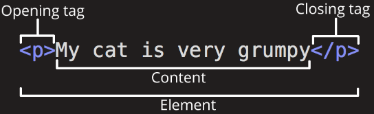
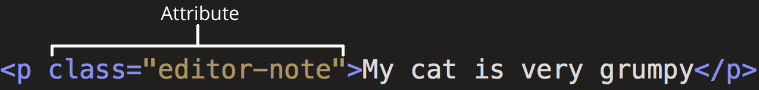
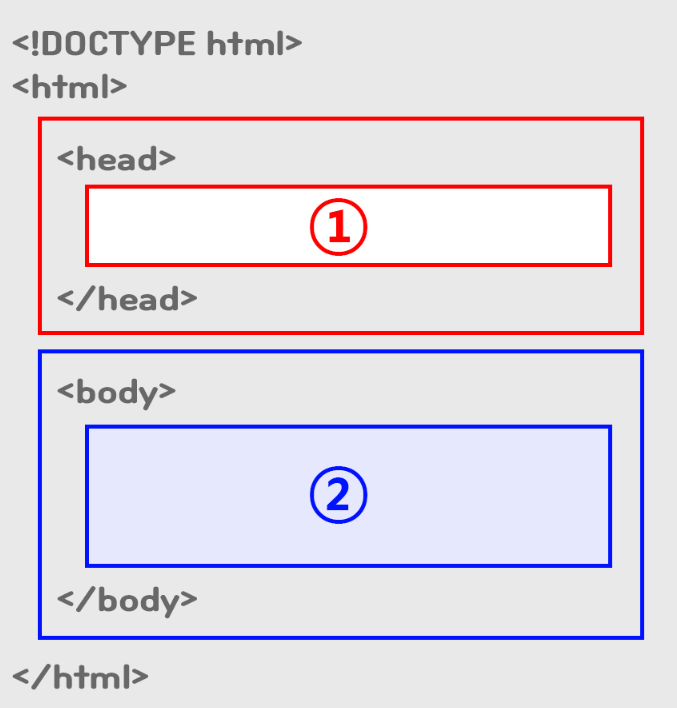
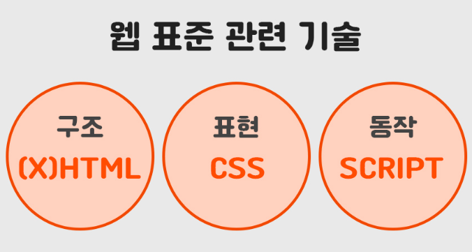

# HTML 기초

- Hyper Text Markup Language 의 약자이며, 홈페이지를 만드는데 있어서 기본적인 프로그램 언어이다.

HTML은 크게 head와 body로 구성된다.

## HTML의 구조


- **여는 태그 (Opening tag)**: 이것은 요소의 이름으로 구성되고 (여기에서는 p), **여닫는 꺾쇠괄호**로 감싸집니다. 이것은 요소가 시작되는 곳, 또는 효과를 시작하는 곳임을 나타냅니다. 이 예제에서는 **문단이 시작되는 위치**를 나타냅니다.
</br>

- **닫는 태그 (Closing tag)**: 이것은 여는 태그와 같지만, 요소의 이름 앞에 전방향 슬래시가 포함된다는 점이 다릅니다. 이것은 **요소의 끝**을 나타냅니다. 이 예제에서는 문단이 끝나는 위치를 나타냅니다. 초보자가 가장 흔히 범하는 오류 중 하나가 닫는 태그를 쓰지 않는 것으로 이상한 결과가 표시됩니다.
</br>

- **콘텐츠 (Content)**: 이것은 요소의 내용(content)으로 이 예제에서는 그냥 **텍스트**입니다.
- **요소 (Element)**: 요소는 여는 태그와 닫는 태그, 그리고 콘텐츠로 이루어집니다.

</br>



> 요소는 속성도 가질 수 있으며, 클래스 속성을 이용해 나중에 해당 요소를 특정해 스타일이나 다른 정보를 설정할 때 사용할 수 있는 식별자를 지정할 수 있다.

- 속성은 대부분 `name = "value"`와 같이 이름/값이 쌍으로 제공됩니다.

</br>

## HTML 작성
- `<!DOCTYPE html>` : DOCTYPE 선언은 HTML 문서에서 `<html>` 태그를 정의하기 전에 가장 먼저 선언되어야 한다.

</br>

- `<html>` : 모든 HTML 태그는 <html> 태그 내부에 작성하여야 한다.

</br>

- `<Head>` : head에 작성하는 코드들은 웹 페이지 화면에 표시되지 않고 웹 페이지의 정보 또는 CSS, javascript 파일 등을 연결하는데 사용한다.
```html
 	<head>
 		<title>오렌지</title>
 	</head>
```

</br>

- `<title>` : 웹페이지의 제목 태그.

</br>

- `<body>` : 사용자에게 실제 보이는 부분을 작성한다.

</br>

- `h1~h6` : 단계별 주제(head)를 나타내는 대제목/소제목
```html
 	<h1>오늘의 목표</h1>
```
</br>

- `ul` : 내용을 리스트 형태로 나열할때 사용하는 태그 , unordered list (* dot list) // ordered list = 1,2,3...

```html
 	<ul>
 	
 	</ul>
```
</br>

- `li` : `ul` 내부에서 아이템 하나하나를 작성할때 사용하는 태그 , list item
```html
 	<ul>
 		<li>오렌지</li>
 		<li>바나나</li>
 		<li>딸기</li>
 	</ul>
```
</br>

- `img` : html에서 이미지를 활용하는 태그, img는 닫는 지점이 없다
```html
 
```
</br>

- `div` : 
    - 여러개의 태그를 그룹핑 할때 쓰는 태그
    - 한번에 CSS를 적용하기 위한 태그

</br>



> 태그 앞 들여쓰기를 잘 맞춰서 작성해야 구조 이해가 쉽고, 빠르게 수정할 수 있다

### 웹표준이란?
- 웹에서 표준적으로 사용되는 기술이나 규칙을 말한다.
- W3C가 권고한 표준안에 따라 웹 사이트를 작성할 때 이용하는 HTML, CSS, Javascript 등에 대한 규정이 담겨져있다.



