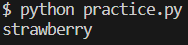

# python 01

## 01. 설치하기
1. [파이썬 홈페이지](https://www.python.org/downloads/) 파이썬 공식 홈페이지에서 3.11.5 버전 다운로드 후 설치하기
    - 하단 체크박스 'Add python.exe to PATH' 체크한 후 Install Now 누르고 설치하기
    (윈도우 환경설정의 PATH 변수에 python 라이브러리 위치를 추가하겠다는 뜻)
2. python 버전 확인
- Git Bash에서 확인
    - python -V 입력 후 설치한 버전이 맞는지 확인
- VSC 에서 확인
    - python -V 입력 후 설치한 버전이 맞는지 확인

## 02. 변수의 정의 (variable)
- 변수란, '변할 수 있는 것'으로 어떠한 값을 담아내는 **상자**라고 생각하면 된다.
```
a = 10
```
### (1). 파이썬의 변수 이름 붙이기 규칙
> 변수 이름을 정할 때 지켜야 하는 규칙은 다음과 같다.
- 변수 이름에는 알파벳 대문자와 소문자, 숫자, 밑줄(_)만 사용할 수 있다. (ex: PyThon, python, python_01)
- 변수이름은 대소문자를 구분해야된다. 같은 이름이지만 대소문자가 다르면 다른 변수로 취급한다. (ex: apple, Apple)
- 변수 이름 중간에는 공백은 들어갈 수 없다. 두 개 이상의 단어로 묶어 사용하려면 단어 사이에 밑줄을 사용한다.


### (2). 변수와 데이터 타입
> python은 변수에 저장되는 값에 따라서 변수의 타입이 결정된다.

- 숫자 (int) - 정수
```
dust = 10
```

- 글자 (string) - 문자열
```
dust = '5'
```

- 참/거짓(boolean) - 논리
```
dust = True, False
```


### (3). 리스트(list)란?
> 특정 순서가 있는 항목을 나열합니다. 리스트에는 보통 항목이 두 개 이상 있기에 리스트 이름은 복수형으로 사용합니다.
>
> 파이썬에서 리스트는 대괄호([])로 표현하며, 리스트의 각 항목은 콤마(,)로 구분합니다. 다음은 예제로 나열한 리스트입니다.

```
fruits_list = ['mango', 'blueberry', 'strawberry', 'banana', 'grape']
print(fruits_list)
```
파이썬에서 위 리스트로 입력하면 리스트를 표현해줍니다.

#### (3-1). 인덱스(index)
> 리스트내의 각각의 데이터에는 순서가 존재합니다. 이를 인덱스라고 하며, 인덱스는 0부터 카운트 합니다.
>
> 인덱스를 지정하려면 리스트 이름을 쓰고 그다음 대괄호 안에 인덱스를 사용합니다.
```
fruits_list = ['mango', 'blueberry', 'strawberry', 'banana', 'grape']
print(fruits_list[2])
```
이렇게 리스트의 2번째를 지정하게되면 파이썬은 대괄호없이 값만 반환합니다.



#### (3-2). 딕셔너리(dictionary)
> 딕셔너리(dict)는 리스트(list)처럼 순서대로 나열되어있는 정보를 구하지않고 각 키(key)값과 연결되고 키(key)를 통해 연결된 값(value)을 반환합니다.
>
> 딕셔너리(dict)는 key-value를 중괄호({})로 감싼 형태이다.

```
fruits_dict = {
    '서울': 'mango'
    '대전': 'banana'
    '밀양': 'grape'
    '마산': 'strawberry'
}
print(fruits_dict['마산'])
```
이 코드는 fruits_dict 딕셔너리에서 '마산'에 해당하는 값을 반환합니다.


## 03. 제어문

### (1). if문 


## 04. 반복문