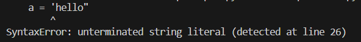

# 1. Intro
## 1.1 Jupyter lab 설치
```python
pip install jupyterlab
```
Jupyter lab 설치 후 실행하기
```python
jupyter lab
```
### 1.1.1 Jupyter lab 실행 단축키
- ctrl + enter: 지금 셀 실행
- shift + enter: 지금 셀 실행 & 아래로 이동
- alt + enter: 지금 셀 실행 & 아래에 새로운 셀 추가

## 1.2. 변수와 데이터 타입
변수란 '변할 수 있는 것'으로 어떠한 값을 담아내는 **상자**라고 생각하면 된다.
```
a = 10
변수이름 = 값 (오른쪽에 있는 값을 왼쪽에 할당한다.)
그리고 변수를 선언한다라고 표현한다.
```
- 변수이름은 어떠한 이름이든 상관 없음.
- 영어, 숫자, `_`를 이용하여 선언.
- 영어는 대소문자를 구분하여 사용.
- 키워드는 사용불가.
```python
사용불가한 키워드를 알 수 있는 방법
import keyword
keyword.kwlist
```
### 1.2.1 숫자(number)
- 정수(integer): 소수점이 존재하지 않는 양수 또는 음수

- 실수(float): 0.12, 1.23과 같이 소수점이 있는 양수 또는 음수

- 복소수(complex number): 실수부(real part)와 허수부(imaginary part)로 나누고 허수부 앞에 j나 J를 표기함
    - 변수.real 와 변수.imag는 각각 변수의 실수와 허수부의 값을 나타냄

### 1.2.2 불리언(boolean)
- `True`, `False`로 이루어진 타입
- 참과 거짓을 만들 때 사용하는 연산자의 종류
    > - `==` 같다
    > - `!=` 다르다
    > - `>` 왼쪽이 더 크다
    > - `<` 오른쪽이 더 크다
    > - `>=` 왼쪽이 더 크거나 같다
    > - `<=` 오른쪽이 더 크거나 같다

### 1.2.3 None
- **값이없다**는 뜻으로, 'None'이라는 값을 가지고 있는 데이터 타입.
```python
score = None
print(score)
None
```

### 1.2.4 문자열(string)
- 문자열은 `'`, `"` 를 이용하여 표현
- **두가지를 섞어서 표현하진 않음** (아래사진은 `'`와 `"`를 섞어서 썼을 때 발생하는 에러)


#### input() 함수
표준입력: 사용자로부터 값을 입력받아 변수에 대입하고자 한다면 input 함수를 사용.
> **모든것을 글자로 적용**하기때문에 필요한 자료형이 아닐경우 형변환이 필요.
```python
name = input('이름:')
age = input('나이:')
print('이름:', name, '나이:', age)
```
#### string interpolation (문자열 보간)

1. %-formatting
2. str.format()
3. f-string

> 1. **%-formatting**
> ```python
> age = 100
> print('홍길동은 %s살입니다.' % age)
> 홍길동은 100살입니다.
> ```

> 2. **str.format()**
> ```python
> age = 100
> print('홍길동은 {}살입니다.'.format(age))
> 홍길동은 100살입니다.
> ```

> 3. **f-string** (비교적 최신 문법)
> ```python
> age = 100
> print(f'홍길동은 {age}살입니다.')
> 홍길동은 100살입니다.
> ```