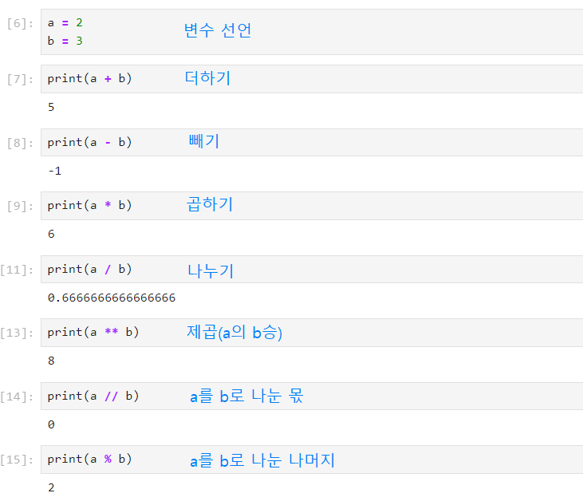
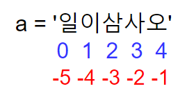

## Contents
[1. Intro](#1-intro)<br/>
[1.1. Jupyter lab 설치 및 실행](#11-jupyter-lab-설치)<br/><br/>
[1.2. 변수와 데이터 타입](#12-변수와-데이터-타입)<br/>
[1.2.1 숫자(number)](#121-숫자number)<br/>
[1.2.2 불리언(boolean)](#122-불리언boolean)<br/>
[1.2.3 None](#123-none)<br/>
[1.2.4 문자열(string)](#124-문자열string)<br/><br/>
[2. 연산자](#2-연산자)<br/>
[2.1. 산술연산자](#21-산술연산자)<br/>
[2.2. 비교연산자](#22-비교연산자)<br/>
[2.3. 논리연산자](#23-논리연산자-not-and-or)<br/>
[2.4. 복합연산자](#24-복합연산자)<br/>
[2.5. 기타연산자](#25-기타연산자)<br/><br/>
[3. 형변환](#3-형변환)<br/>
[3.1. 암시적 형변환](#31-암시적-형변환)<br/>
[3.2. 명시적 형변환](#32-명시적-형변환)<br/><br/>
[4. 시퀀스(sequence) 자료형](#4-시퀀스sequence-자료형)<br/>
[4.1. List(배열)](#41-list배열)<br/>
[4.2. Tuple](#42-tuple)<br/>
[4.3. range](#43-range)<br/>
[4.5. Sequence(시퀀스)에서 사용가능한 연산/함수](#45-sequence시퀀스에서-사용가능한-연산함수)<br/><br/>
[5. Sequence(시퀀스) 데이터가 아닌 자료구조](#5-sequence시퀀스-데이터가-아닌-자료구조)<br/>
[5.1. set](#51-set)<br/>
[5.2. dictionary](#52-dictionary)<br/>
<br/>
<br/>
<br/>
<br/>

# 1. Intro
## 1.1. Jupyter lab 설치
```python
pip install jupyterlab
```
Jupyter lab 설치 후 실행하기
```python
jupyter lab
```
### 1.1.1 Jupyter lab 실행 단축키
- ctrl + enter: 지금 셀 실행
- shift + enter: 지금 셀 실행 & 아래로 이동
- alt + enter: 지금 셀 실행 & 아래에 새로운 셀 추가

## 1.2. 변수와 데이터 타입
변수란 '변할 수 있는 것'으로 어떠한 값을 담아내는 **상자**라고 생각하면 된다.
```
a = 10
변수이름 = 값 (오른쪽에 있는 값을 왼쪽에 할당한다.)
그리고 변수를 선언한다라고 표현한다.
```
- 변수이름은 어떠한 이름이든 상관 없음.
- 영어, 숫자, `_`를 이용하여 선언.
- 영어는 대소문자를 구분하여 사용.
- 키워드는 사용불가.
```python
사용불가한 키워드를 알 수 있는 방법
import keyword
keyword.kwlist
```
### 1.2.1 숫자(number)
- 정수(integer): 소수점이 존재하지 않는 양수 또는 음수

- 실수(float): 0.12, 1.23과 같이 소수점이 있는 양수 또는 음수

- 복소수(complex number): 실수부(real part)와 허수부(imaginary part)로 나누고 허수부 앞에 j나 J를 표기함
    - 변수.real 와 변수.imag는 각각 변수의 실수와 허수부의 값을 나타냄

### 1.2.2 불리언(boolean)
- `True`, `False`로 이루어진 타입

### 1.2.3 None
- **값이없다**는 뜻으로, 'None'이라는 값을 가지고 있는 데이터 타입.
```python
score = None
print(score)
None
```

### 1.2.4 문자열(string)
- 문자열은 `'`, `"` 를 이용하여 표현
- **두가지를 섞어서 표현하진 않음** (아래사진은 `'`와 `"`를 섞어서 썼을 때 발생하는 에러)


#### input() 함수
표준입력: 사용자로부터 값을 입력받아 변수에 대입하고자 한다면 input 함수를 사용.
> **모든것을 글자로 적용**하기때문에 필요한 자료형이 아닐경우 형변환이 필요.
```python
name = input('이름:')
age = input('나이:')
print('이름:', name, '나이:', age)
```
#### string interpolation (문자열 보간)

1. %-formatting
2. str.format()
3. f-string

> 1. **%-formatting**
> ```python
> age = 100
> print('홍길동은 %s살입니다.' % age)
> 홍길동은 100살입니다.
> ```

> 2. **str.format()**
> ```python
> age = 100
> print('홍길동은 {}살입니다.'.format(age))
> 홍길동은 100살입니다.
> ```

> 3. **f-string** (비교적 최신 문법)
> ```python
> age = 100
> print(f'홍길동은 {age}살입니다.')
> 홍길동은 100살입니다.
> ```

# 2. 연산자
## 2.1. 산술연산자
흔히 아는 (`+`, `-`, `*`, `/`)를 연산자라고 표현.


### divmod() 함수
`divmod()`는 두개의 숫자를 인자로 받아서 첫번째 숫자를 두번째 숫자로 나눈 몫과 나머지를 한번에 연산할때 사용
```python
a = 2
b = 3

print(divmod(a, b))
(0, 2)
```
`divmod()` 함수는 다음과 같이 일반 연산자를 사용하여 나타낼 수 있음.
```python
divmod(a, b) = (a // b, a % b)
```

## 2.2. 비교연산자
- 연산자의 종류
    > - `==` 같다
    > - `!=` 다르다
    > - `>` 왼쪽이 더 크다
    > - `<` 오른쪽이 더 크다
    > - `>=` 왼쪽이 더 크거나 같다
    > - `<=` 오른쪽이 더 크거나 같다

## 2.3 논리연산자 (not, and, or)
조건문이 참(True)인지 거짓(False)인지 판단하는것을 의미.
> 논리연산자의 결과는 bool타입으로 반환.

**1. and 연산자**

- A **and** B
- 조건 A 와 조건 B가 모두 참이면 참(True)을 반환.
- 하나라도 거짓이면 거짓(False)을 반환.

**2. or 연산자**
- A **or** B
- 조건 A, B 둘 중 하나라도 참(True)이면 참을 반환.
- **둘 다 거짓인 경우에만 거짓(False)**

**3. not연산자**
- **not** A
- A가 거짓이라면 참(True)을 반환.
- A가 참이라면 거짓(False)을 반환.

#### 단축평가(and)
```python
print(3 and 5)
print(3 and 0)
print(0 and 5)
print(0 and 0)
5
0
0
0
```

#### 단축평가(or)
- 앞에있는게 True면 뒤에있는 결과가 중요하지 않음.
```python
print(3 or 5)
print(3 or 0)
print(0 or 5)
print(0 or 0)
3
3
5
0
```
```python
print(None or 'index.html')
index.html
print('login.html' or 'index.html')
login.html
```

## 2.4 복합연산자

> - `+=` : 왼쪽 변수에 오른쪽 값을 더하고 그 결과를 왼쪽 변수에 할당<br/>
    > - `-=` : 왼쪽 변수에 오른쪽 값을 빼고 그 결과를 왼쪽 변수에 할당<br/>
    > - `*=` : 왼쪽 변수에 오른쪽 값을 곱하고 그 결과를 왼쪽 변수에 할당<br/>
    > - `/=` : 왼쪽 변수에 오른쪽 값을 나누고 그 결과를 왼쪽 변수에 할당<br/>
    > - `%=` : 왼쪽 변수에 오른쪽 값을 나눈 후 그 **나머지**를 왼쪽 변수에 할당<br/>
    > - `//=` : 왼쪽 변수에 오른쪽 값을 나눈 후 그 **몫**을 왼쪽 변수에 할당<br/>
    > - `**=` : 왼쪽 변수에 오른쪽 값을 **제곱**하고 그 결과를 왼쪽 변수에 할당<br/>

## 2.5 기타연산자

**1. concatenation**
- 숫자가 아닌 자료형은 `+`연산자를 통해 합칠 수 있다.
```python
a = 'hi'
b = 'hello'
print(a + b)
'hihello'
```

**2. containment test**
- `in`연산자를 통해 속해있는지 여부를 확인 가능
```python
print('a' in 'apple')
print('z' in 'apple')
True
False
```
```python
# 리스트에도 가능
print('1' in [1, 2, 3])
print('100' in [1, 2, 3])
True
False
```

**3. identity**
- `is`연산자를 통해 동일한 object인지 확인 가능
- 양쪽에 있는 데이터가 같냐긴 보다 **데이터가 실제로 있는 위치가 똑같은지** 확인
```python
a = 123123
b = 123123
print(a is b)
False
```

```python
# -5 ~ 256의 값에 대해서는 같은 object 주소를 참조
a = 10
b = 10
print(a is b)
True
```

#### 연산자 우선순위
0. ()를 통해 그룹
1. **
2. 산술연산자(*, /)
3. 산술연산자(+,-)
4. 비교연산자, is, in
5. not
6. and, or

## 3. 형변환

### 3.1 암시적 형변환
- 사용자가 의도하지 않았지만 python 내부적으로 자동으로 형변환 하는 경우
- **boolean, Numbers(int, float, complex)** 만 가능

```python
a = True
b = False
c = 1

print(a + c)
print(b + c)
2
1

# boolean형태는 각각 1과 0으로 나타내어짐.
```

```python
int_num = 3
float_num = 3.3
complex_num = 3 + 3j

print(int_num + float_num)
print(int_num + complex_num)
6.3
(6+3j)

```

### 3.2 명시적 형변환
- 위의 상황을 제외하고는 모두 명시적으로 형변환을 해야함

    > 1. str -> int: 형식에 맞는 숫자만 가능
    > 2. int -> str: 모두 가능

- 암시적 형변환이 되는 경우도 명시적으로 형변환이 가능

    > 1. int(): str, float를 int로 변환
    > 2. float(): str, int를 float으로 변환
    > 3. str(): int, float, list, tuple, dict를 문자열로 변환
    >
    > **단, str안에 float형태는 int로 변환할 수 없음**

```python
a = 1
b = '번'
print(a + b)

TypeError: unsupported operand type(s) for +: 'int' and 'str'

# a를 str형태로 형변환
print(str(a) + b)
```

```python
# a를 int형태로 형변환
a = '100'
print(type(int(a)))
```

```python
# input형태에서 int형태로 형변환하기
age = int(input())
print(type(age))
```

```python
# int형태에서 boolean형태로 형변환하기
a = 1
b = 0
c = 100

print(bool(a))
print(bool(b))
print(bool(c))
True
False
True
```

```python
# str형태에서 boolean형태로 형변환하기
print(bool(''))
print(bool('a'))
False
True
```

```python
# list에서 boolean형태로 형변환하기
print(bool([]))
print(bool([1, 2, 3]))
False
True
```

## 4. 시퀀스(sequence) 자료형
- 시퀀스(sequence)는 데이터의 순서대로 나열된 자료구조
- **순서대로 나열되어있다는것은 정렬된것과는 다르다.**

> 1. 리스트(list)
> 2. 튜플(tuple)
> 3. 레인지(range)
> 4. 문자열(string)

### 4.1 List(배열)
- 선언 : 변수이름 = [value1, value2, value3]
- 접근 : 변수이름[index]

```python
l = []
print(l)
print(type(l))

[]
<class 'list'>
# list인것 확인가능
```

```python
location = ['서울', '대전', '부산']
print(location)
print(type(location))

['서울', '대전', '부산']
<class 'list'>

print(location[3])

IndexError: list index out of range

print(location[2])
print(location[-3])

부산
서울

# 배열을 선언하고 어떻게 접근하는지 확인

location[2] = '제주'
print(location)

['서울', '대전', '제주']

# list는 수정가능함을 확인
```

### 4.2 Tuple
- 선언 : 변수이름 = (value1, value2, value3)
- 접근 : 변수이름[index]
- List와 유사하지만 수정불가능(immutable)하다.

```python
t = (1, 2, 3)
print(t)
print(type(t))
print(t[2])

(1, 2, 3)
<class 'tuple'>
3
```

```python
t[2] = 100

TypeError: 'tuple' object does not support item assignment
# tuple object는 수정이 불가능함.
```

```python
divmod(9, 4)

(2, 1)

result = divmod(9, 4)
print(type(result))
print(result[0])

<class 'tuple'>
2

# 내부적으로 변함이 없는 object를 사용할 때에 주로 사용
```

```python
# Tuple의 방식1
x, y = (1, 2)
print(x, y)

1, 2

# Tuple의 방식2
x, y = (y, x)
print(x, y)

2, 1
```

### 4.3 range
- 숫자의 시퀀스를 나타내기 위해 사용
    - `range(n)` (기본형) : `0`부터 `n-1`까지 범위
    - `range(n, m)` (범위지정) : `n`부터 `m-1`까지 범위
    - `range(n, m, s)` (범위 및 스텝지정) : `n` 부터 `m-1` 까지 `+s` 만큼 증가

```python
# range(n)

r = range(5)
print(r)
print(type(r))

# range(n, m)
range(0, 5)
<class 'range'>

r = range(5, 15)
print(r)

range(5, 15)

# range(n, m, s)
r = range(5, 15, 2)
print(r)

range(5, 15, 2)
# '레이지하다'는 게으른 연산, 선언할 때 바로 데이터로 바꿔주는게 아니라 내가 사용할때만 형변환해준다.
list(r)

[5, 7, 9, 11, 13]
```

### 4.4 string
위 기본 데이터 구조 참고

### 4.5 Sequence(시퀀스)에서 사용가능한 연산/함수
```python
my_list = [1, 2, 3, 4, 5]
my_tuple = (11, 12, 13, 14, 15)
my_range = range(1, 10, 2)
my_string = '일이삼사오'
```

#### indexing(인덱싱)
- '무엇을 가리킨다'의 의미
- 문자열에서 각각의 문자들은 번호가 매겨져있고, 이것을 이용하여 특정한 문자를 뽑아내는것을 말한다.
```python
# indexing

print(my_list[1])
print(my_tuple[1])
print(my_range[1])
print(my_string[1])

2
22
3
이
```


#### slicing(슬라이싱)
- **여러 개의 문자를 한 번에 가져오고 싶을 때**
- 어디서부터 어디까지의 문자를 가져올 것인지 구간으로 정해서 입력
- 변수[이상:미만:간격], 이때 간격이 필요없다면 변수[이상:미만]로 표현

```python
print(my_list[1:3])
# mt_list의 1부터 3번째 전까지 출력
print(my_tuple[1:3])
print(my_range[1:3])
print(my_string[1:3])

[2, 3]
(12, 13)
range(3, 7, 2)
이삼

# 간격
print(my_list[1:4:2])
print(my_range[2:7:2])

[2, 4]
range(5, 11, 4)
```

#### in 시퀀스객체
- 시퀀스 객체에 `in`연산자를 사용했을 때 특정 값이 있으면 True, 없으면 False가 나옴
```python
a = [0, 10, 20, 30]

print(1 in a)

False
```

#### not in 시퀀스객체
- 반대로 in 앞에 not을 붙이면 특정 값이 없는지 확인

```python
a = [0, 10, 20, 30]

print(1 in a)

True
```

#### concatenation(연계)

```python
a = [0, 1, 2]
b = [3, 4, 5]

print(a + b)

[0, 1, 2, 3, 4, 5]
```
**주의사항**
- 데이터 타입이 서로 다른 변수를 연산 할 수 없다.
```python
a = 'hi'
b = 1

print(a +b)

TypeError: can only concatenate str (not "int") to str
```

#### `*` (곱셈) 연산
- s `*` n : n번만큼 반복하여 더하기

#### `len` 길이
```python
hello = 'Hello, world!'

len(hello)
13
# 문자열의 길이는 공백까지 포함
```

#### `min/max` (최솟값/최댓값)
```python
min(my_tuple)
11
max(my_range)
9
```

#### `.count()` 함수
- 문자열에 해당하는 문자가 몇 개 들어있는지 확인할 때 
```python
my_list = [1, 2, 3, 4, 5]

my_list.count(1)
1
```

## 5. sequence(시퀀스) 데이터가 아닌 자료구조

### 5.1 `set`
- 수학에서 사용하는 집합과 동일하게 처리
- **데이터들의 중복을 허용하지 않음**
- **데이터들간의 순서가 없기 때문에 인덱싱이나 슬라이싱을 이용하여 값 추출 불가능**
- 선언 : 변수이름 = {value1, value2, value3}

```python
my_set_a = {1, 2, 3, 4, 5}
my_set_b = {1, 3, 5, 7, 9}

# 차집합연산
print(my_set_a - my_set_b)
# 합집합(파이프기호) = or
print(my_set_a | my_set_b)
# 교집합연산 =  and
print(my_set_a & my_set_b)

{2, 4}
{1, 2, 3, 4, 5, 7, 9}
{1, 3, 5}

# 리스트에 중복된 데이터의 중복을 제거하고 싶을 때
my_list = [1, 2, 3, 4, 5, 1, 2, 3, 7, 8, 2, 2]
print(set(my_list))
```

### 5.2 `dictionary`
- 선언 : 변수이름 = {key1 : value1, key2 : value2, key3 : value3}
- 접근 : 변수이름[key]
- dictionary는 key와 value가 쌍으로 이루어져있다.
- key에는 immutable한 모든 값을 사용가능하다. (불변값: string, integer...)
- value에는 모든 데이터가 가능하다. (list, dict도 가능)

```python
dict_a = {
    'name': 'tina',
    'age': 20,
    'location': 'seoul',
    'numbers': [1, 2, 3, 4, 5],
    # 딕셔너리 안에 딕셔너리 넣기
    'friends': {
        'a': 21,
        'b': 22,
    }
}

print(dict_a['age'])
print(dict_a['numbers'][3])
print(dict_a['friends']['b'])
20
4
22
```

```python
# key목록 출력
dict_a.keys()
dict_keys(['name', 'age', 'location', 'numbers', 'friends'])

# value목록 출력
dict_a.values()
dict_values(['tina', 20, 'seoul', [1, 2, 3, 4, 5], {'a': 21, 'b': 22}])
```
